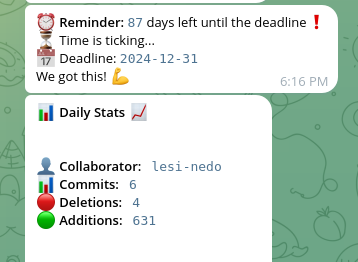

# Telegram Deadline Reminder Bot

This project is a Telegram bot that helps you keep track of project deadlines and provides daily statistics about GitHub repository activities. It's designed to send reminders about upcoming deadlines and share information about commits, additions, and deletions made by collaborators.

## Features

1. **Deadline Reminders**: The bot sends daily reminders about an upcoming deadline.
2. **Customizable Deadline**: Users can set a new deadline using a Telegram command.
3. **GitHub Integration**: The bot fetches and reports statistics from a specified GitHub repository.
4. **Daily Stats**: It provides daily updates on commits, additions, and deletions made by each collaborator.

## Requirements

- Python 3.7 or higher
- `python-telegram-bot` library
- `python-dotenv` library
- `urllib3` library

## Setup

1. Clone this repository to your local machine.

2. Install the required Python packages:
   ```
   pip install python-telegram-bot python-dotenv urllib3
   ```

3. Create a `.env` file in the project root directory with the following variables:
   ```
   TELEGRAM_BOT_TOKEN=your_telegram_bot_token
   TELEGRAM_CHAT_ID=your_chat_id
   DEADLINE_DATE=YYYY-MM-DD
   GITHUB_URL=https://api.github.com
   GITHUB_REPO=your_repo_name
   GITHUB_OWNER=repo_owner_username
   GITHUB_TOKEN=your_github_personal_access_token
   ```

   Replace the placeholder values with your actual data.

4. Run the bot:
   ```
   python your_script_name.py
   ```

   Or if you want to specify a different .env file:
   ```
   python your_script_name.py path_to_your_env_file
   ```

## Usage

Once the bot is running, you can interact with it using these commands:

- `/start`: Initiates the bot and provides a welcome message.
- `/setdeadline YYYY-MM-DD`: Sets a new deadline date.
- `/manual_reminder`: Triggers a manual reminder message.
- `/daily_stats`: Requests the daily GitHub statistics.

The bot will automatically send daily reminders and statistics at preset times (7:00 UTC for reminders, 21:00 UTC for stats).

## How It Works

1. The bot connects to the Telegram API using the provided token.
2. It schedules daily tasks for sending reminders and statistics.
3. For GitHub statistics, it fetches data about collaborators and their commits using the GitHub API.
4. The bot processes this data and sends formatted messages to the specified Telegram chat.

## Customization

You can modify the scheduled times for reminders and stats by adjusting the `time` parameter in the `run_daily` method calls within the `main()` function.


## Example

Below is an example of how the bot interacts with the user. The screenshot `img.png` shows the bot in action.



1. **Start Command**: The user initiates the bot with the `/start` command.
    - **Bot's Response**: "Hello! I'm your deadline reminder bot. Use /setdeadline YYYY-MM-DD to set a new deadline."
2. **Set Deadline Command**: The user sets a new deadline using the `/setdeadline YYYY-MM-DD` command.
    - **Bot's Response**: "Deadline updated to YYYY-MM-DD"
3. **Manual Reminder**: The user triggers a manual reminder using the `/manual_reminder` command.
    - **Bot's Response**: "Reminder: X days left until the deadline!" (or "Today is the deadline!" or "The deadline has passed by X days.")
4. **Daily Stats**: The bot sends daily statistics about commits, deletions, and additions from the specified GitHub repository.
    - **Bot's Response**: 
        ```
        📊 *Daily Stats* 📈

        👤 *Collaborator:*   `collaborator_name`
        📊 *Commits:*   `number_of_commits`
        🔴 *Deletions:*   `number_of_deletions`
        🟢 *Additions:*   `number_of_additions`
        ```


## Troubleshooting

- Ensure all environment variables are correctly set in the `.env` file.
- Check that your Telegram bot token and GitHub personal access token are valid.
- Verify that the GitHub repository and owner details are correct.
- If you encounter any "Chat migrated" errors, the bot will automatically update to the new chat ID.

## Contributing

Contributions to improve the bot are welcome. Please feel free to submit issues or pull requests.

## License

This project is licensed under the MIT License.
